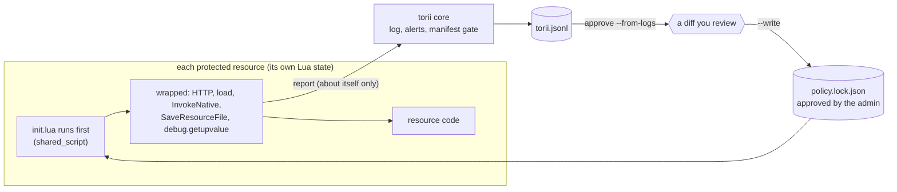

<p align="center">
  <picture>
    <source media="(prefers-color-scheme: dark)" srcset="assets/banner-dark.svg">
    
  </picture>
</p>

<p align="center">
  <a href="https://github.com/inari-suite-org/torii-fx/actions/workflows/ci.yml"></a>
  
  
  
  
</p>

> [!WARNING]
> **Experimental.** torii has been tested on a development server only, with no players connected. It has not yet run
> on a server with real players, so its behaviour under real traffic is unknown. Keep it in **observe mode** (the
> default, which blocks nothing) and only switch to enforce mode after testing it with your own resources. Current
> state: [STATUS.md](STATUS.md).

torii gives every FiveM resource a short list of permissions, in the way Android and Deno do. It does not try to
recognise a backdoor. A backdoor, however well it is obfuscated, still has to **call out to a host** and **run what
it downloads**, and those are the two things torii controls.

<p align="center">
  
</p>

<sub>Abridged replay of a real FXServer console session (build 36897) running the harmless
[demo resource](demo/torii_demo_backdoor). Full transcript in [docs/demo.md](docs/demo.md).</sub>

## The problem

Third-party resources (bought, free, "leaked") run with the full power of your server. A few obfuscated lines are
enough to download code from a stranger's machine, run it with `load`, read your `rcon_password` and hand out admin
rights. Most anti-backdoor tools are static scanners: they look for patterns they already know.

| | Static scanner | torii |
|---|---|---|
| A new obfuscation | missed until someone writes a signature | still blocked: it has to reach a host and execute text |
| What you maintain | signatures, re-scans | a lockfile you approve once and review on updates |
| A legitimate resource calling an API | false positive | declared, approved, works |
| When it acts | when you remember to scan | at run time, inside the resource |
| What you get | "suspicious file" | resource, call, target, `file:line`, reason |

torii does not replace code review, backups or an egress firewall. It adds a layer that does not depend on
recognising the malware.

## How it works



1. **Inside the sandbox, first.** Each resource has its own Lua state, and `shared_script '@torii/init.lua'` is the
   first thing that runs in it (checked on a real server). The wrappers exist before any other code of that resource.
2. **Declare is not grant.** A resource can ask for permissions in its manifest. Only your lockfile grants them, and it
   stores a hash of the declaration you reviewed, so an update that changes the request is reported.
3. **Observe first.** The default mode only logs what would be blocked, so you can install torii on a live server
   without breaking anything, then switch to enforcement once the diff looks right.

## Install in three steps

> Requirements: Node.js 18+ for the CLI, and a recent FXServer artifact (developed and tested on build **36897**).
> Older builds are untested and may lack the cross-resource write protection torii relies on to protect its own files.

**1. Add the resource.** Copy `torii/` into `resources/` and make it the **first** `ensure` in `server.cfg`.

**2. Protect your resources.** One line is added to each manifest. Backups are kept as `*.torii.bak` and
`uninstall` reverses everything.

```bash
node cli/torii.mjs install /path/to/resources
node cli/torii.mjs status  /path/to/resources
```

**3. Observe, approve, enforce.** Restart, play for a while (nothing is blocked), then:

```bash
node cli/torii.mjs approve /path/to/resources --from-logs resources/torii/logs/torii.jsonl
# read the diff, then add --write
```

```text
set torii_mode "enforce"
```

For well-known libraries (ox_lib, es_extended, qb-core...), `--use-presets` adds what they legitimately need. It is
opt-in and explained in [docs/presets.md](docs/presets.md).

To try it before touching real resources, `ensure torii_demo_backdoor` runs a harmless imitation of a remote loader
(a `.invalid` domain, no payload) so you can watch both modes.

## Permissions

<table>
<tr><th>The resource asks (<code>fxmanifest.lua</code>)</th><th>The admin grants (<code>policy.lock.json</code>)</th></tr>
<tr><td>

```lua
torii_http 'api.weather.example'
torii_http 'discord.com/api/webhooks/1234'
torii_dynamic_code 'yes'
```

</td><td>

```json
"weather": {
  "http": ["api.weather.example",
           "discord.com/api/webhooks/1234"],
  "dynamic_code": true,
  "follow_redirects": false,
  "declaration_hash": "1529d180..."
}
```

</td></tr>
</table>

| Key | Meaning |
|---|---|
| `torii_http 'host'` | HTTPS to that host. Exact match, no wildcards. A port or `http://` must be written out. |
| `torii_http 'host/path'` | Prefix match on segment boundaries: `/api/webhooks/123` covers `/api/webhooks/123/token`, not `/api/webhooks/1234`. |
| `torii_dynamic_code 'yes'` | May run `load` on text (many libraries need it). Lua bytecode is never allowed. |
| `torii_follow_redirects 'yes'` | Keep following HTTP redirects (off by default in enforce mode). |

A complete, commented example is in [examples/](examples/README.md).

Always refused, whatever the lockfile says: `localhost`, private, link-local and loopback ranges (every IPv4 spelling,
IPv6, IPv4 hidden inside IPv6), `*.users.cfx.re`, single-label hosts, and URLs with user info, backslashes, odd
percent-encoding or non-ASCII hosts. For local development only: `set torii_allow_private 1`.

## What it covers

| Behaviour | Observe | Enforce |
|---|---|---|
| Download from or send to an unapproved host (`PerformHttpRequest`) | logged | blocked, looks like a network failure (status 0) |
| The same through `Citizen.InvokeNative` with the native's hash | logged | blocked |
| An approved host that redirects elsewhere | logged | blocked, redirects are not followed |
| `localhost`, the cloud metadata address, private ranges | logged | blocked |
| `load` on text without a grant | logged | blocked, returns `nil, message` |
| `load` on Lua bytecode | blocked | blocked |
| Recovering the real natives through `debug.getupvalue` | blocked | blocked |
| Rewriting `fxmanifest.lua` to drop the protection | logged | blocked |
| A resource with server code and no torii line | logged | refused at start |
| Secret-looking convars, `ExecuteCommand`, `SetHttpHandler` | logged (names only) | logged (names only) |
| JavaScript and C# server scripts | flagged | refused unless exempt |

Nothing sensitive reaches the logs: no bodies, headers, query strings, token-like path segments, convar values or
command arguments.

```text
[torii] BLOCKED  shop_v2  http PerformHttpRequestInternalEx -> https://cipher-panel.example/payload.lua  (not_in_allow_list)  at shop_v2/server/main.lua:48
```

```json
{"ts":"2026-10-07T07:53:39Z","resource":"shop_v2","type":"http","api":"PerformHttpRequestInternalEx","decision":"deny","mode":"enforce","reason":"not_in_allow_list","target":"https://cipher-panel.example/payload.lua","src":"shop_v2/server/main.lua:48","level":"warn"}
```

## Limits

> [!WARNING]
> torii is a seatbelt, not a vault. Read the [threat model](docs/threat-model.md) before relying on it.

- **Server-side Lua only.** JavaScript and C# server code is flagged, not inspected, and the most recent public
  backdoor family is JavaScript. Pair torii with an OS-level egress firewall.
- It does not see harm that needs no network and no `load` (hidden admin commands, economy exploits), nor data that
  leaves through client events or a trusted resource's exports.
- **`dynamic_code` is broad in practice.** Every resource that includes `@ox_lib/init.lua` (most modern scripts)
  compiles ox_lib modules with `load`, so it needs `dynamic_code`, and a resource holding that grant can run any text
  it receives. A narrower rule (allow `load` only on the resource's own files) is planned for v0.2.
- Every bypass we considered and its outcome is in the [bypass table](docs/design.md#4-bypasses-considered).
- It runs **inside the same Lua VM** as the code it guards. Every bypass we know of is closed and has a test
  (`InvokeNative`, native stubs, `debug.getupvalue`, bytecode, redirects, table metamethods), but it is not a hard sandbox.
- An approved host that is itself malicious stays approved. `torii approve` warns about hosts where anyone can publish
  (`pastebin.com`, `*.github.io`) or receive data (`discord.com`). Scope them with a path prefix.
- The manifest line is a request to be protected. If it is missing, FXServer still starts the resource, and torii's
  gate is what notices. Escrow-protected (`.fxap`) resources are untested.

## Questions

<details><summary>Will it slow my server down?</summary>

Only the sensitive natives are wrapped. A micro-benchmark on build 36897 measured about 70 to 140 ns of extra cost
per wrapped call. Capturing the call site (`file:line`) costs about 800 ns and only happens when an event is logged.
</details>

<details><summary>Does it break ox_lib and similar libraries?</summary>

Libraries that compile code with `load` need `torii_dynamic_code`. In observe mode they show up in the log and
`approve --from-logs` proposes the grant, with a warning you should read.
</details>

<details><summary>Can a malicious resource just remove the torii line?</summary>

At run time it cannot: rewriting a manifest through `SaveResourceFile` is blocked. If it ships without the line, the
core's manifest gate reports it, and in enforce mode refuses to start it.
</details>

<details><summary>Can a resource lie in the logs?</summary>

Only about itself, because the core attributes each report with `GetInvokingResource()`. A hostile resource can forge
its own events, which is why `approve` only proposes a diff and never writes without `--write`.
</details>

## Roadmap

- [x] Lua runtime: HTTP, dynamic code, `InvokeNative`, upvalue hardening, manifest gate
- [x] Observe and enforce modes, lockfile with declaration hashes, JSON-lines log
- [x] CLI: `install`, `uninstall`, `status`, `approve --from-logs`, presets for common libraries
- [ ] Compatibility run with ox_lib, a framework and popular scripts on a development server
- [ ] A server with real players in observe mode (until then, torii stays experimental)
- [ ] v0.2: `torii simulate`, `torii explain`, signals about suspicious hosts, `torii doctor`

Details and order: [docs/roadmap.md](docs/roadmap.md). Current state: [STATUS.md](STATUS.md).

## Project

| | |
|---|---|
| [docs/threat-model.md](docs/threat-model.md) | what torii stops, reports, and cannot see |
| [docs/design.md](docs/design.md) | how it works inside FXServer, what can be intercepted, and the choices made |
| [docs/verification.md](docs/verification.md) | what was checked on a real server, and what is still open |
| [docs/presets.md](docs/presets.md) | the suggestions for well-known libraries, and why they are opt-in |
| [STATUS.md](STATUS.md) | where v0.1 stands against its release criteria |
| [docs/roadmap.md](docs/roadmap.md) | what comes next and in which order |
| [research/](research/README.md) | the resources used to check those claims, to run on your own build |
| [CONTRIBUTING.md](CONTRIBUTING.md), [SECURITY.md](SECURITY.md) | contributing, reporting a bypass |

```bash
busted                                   # Lua specs, FiveM natives simulated
luacheck . && stylua --check torii spec  # lint and format
npm test                                 # CLI tests, no dependencies
```

## How it was built

torii is designed and directed by its maintainer, who decides what it does and what ships. A large part of the code
was written with an AI assistant (Claude). We say so because a security tool should not ask you to guess.

What you are asked to trust is not who typed the code but what can be checked: the test suites (`busted`,
`npm test`), the checks on a real FXServer build ([docs/verification.md](docs/verification.md)), and a threat model
that lists what torii cannot see. AI assistance does not replace that work, and every bypass report gets a test.

<p align="center">
  <br>
  <picture>
    <source media="(prefers-color-scheme: dark)" srcset="assets/logo/torii-on-dark.svg">
    
  </picture><br>
  <sub>MIT licensed. Found a bypass? <a href="SECURITY.md">Tell us</a> and we will add the test.</sub>
</p>
