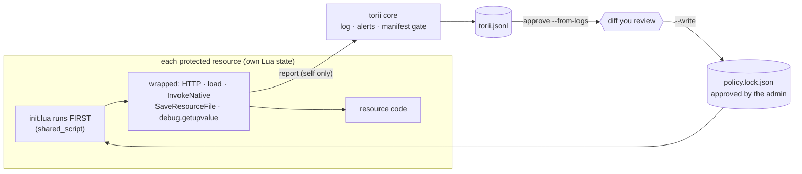
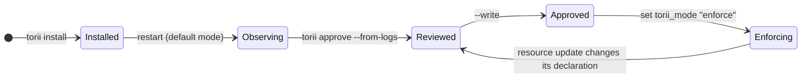

<p align="center">
  <picture>
    <source media="(prefers-color-scheme: dark)" srcset="assets/banner-dark.svg">
    
  </picture>
</p>

<p align="center">
  <a href="https://github.com/OWNER/torii-fx/actions/workflows/ci.yml"></a>
  
  
  
  
  
</p>

<p align="center">
  <b>Don't try to recognise bad code. Control what code is allowed to do.</b><br>
  torii gives every FiveM resource a short list of permissions, the way Android and Deno do.<br>
  A backdoor, however well obfuscated, still has to <i>call home</i> and <i>run what it downloads</i>.
</p>

---

## See it work

<p align="center">
  
</p>

<sub>Abridged replay of a real FXServer console session (build 36897) running the harmless
[demo resource](demo/torii_demo_backdoor). Full transcript: [docs/demo.md](docs/demo.md).</sub>

## Why

Third-party resources (bought, free, "leaked") run with the full power of your server. A few obfuscated lines are
enough to download code from a stranger's server, run it with `load`, read your `rcon_password` and hand out admin.
Most anti-backdoor tools are **static scanners**: they look for patterns they already know.

| | Static scanner | **torii** |
|---|---|---|
| Brand-new obfuscation | missed until someone writes a signature | **still blocked**: it must contact a host and execute text |
| What it needs from you | re-scan, re-update signatures | approve permissions once, review diffs on updates |
| Legit resource that calls an API | false positive | declared, approved, works |
| When it acts | when you remember to scan | **at run time**, inside the resource |
| Output | "suspicious file" | resource, call, target, `file:line`, reason |

torii does not replace review, backups or an egress firewall. It adds a layer that does not depend on recognising the malware.

## How it works



**Three ideas make it work:**

1. **Inside the sandbox, first.** Every resource has its own Lua state. `shared_script '@torii/init.lua'` is the first
   thing that runs in it (checked on a real server), so the wrappers exist before any other code of that resource.
2. **Declare ≠ grant.** A resource can *ask* for permissions in its manifest; only your lockfile *grants* them, and it
   stores a hash of the declaration you reviewed. If an update changes the request, torii tells you.
3. **Observe first.** The default mode only logs what *would* be blocked, so you can install it on a live server
   without breaking anything, then turn enforcement on when the diff looks right.



## Install in 3 steps

> **Requirements:** a recent FXServer artifact (developed and tested on build **36897**) and Node.js 18+ for the CLI.

**1. Add the resource.** Copy `torii/` into `resources/` and make it the **first** `ensure` in `server.cfg`.

**2. Protect your resources.** One line is added to each manifest (backups kept as `*.torii.bak`, fully reversible):

```bash
node cli/torii.mjs install /path/to/resources      # `npx torii-fx ...` once published
node cli/torii.mjs status  /path/to/resources      # who is covered, who runs JS/C# (not covered)
```

**3. Observe, approve, enforce.**

```bash
# restart the server and play for a while: nothing is blocked, everything is logged
node cli/torii.mjs approve /path/to/resources --from-logs resources/torii/logs/torii.jsonl
# read the diff... then
node cli/torii.mjs approve /path/to/resources --from-logs resources/torii/logs/torii.jsonl --write
```
```text
set torii_mode "enforce"
```

Want to see it first? `ensure torii_demo_backdoor` runs a harmless imitation of a remote loader
(a `.invalid` domain, no payload) so you can watch both modes.

## Permissions

<table>
<tr><th>The resource asks (<code>fxmanifest.lua</code>)</th><th>The admin grants (<code>policy.lock.json</code>)</th></tr>
<tr><td>

```lua
torii_http 'api.weather.example'
torii_http 'discord.com/api/webhooks/1234'
torii_dynamic_code 'yes'
```

</td><td>

```json
"weather": {
  "http": ["api.weather.example",
           "discord.com/api/webhooks/1234"],
  "dynamic_code": true,
  "follow_redirects": false,
  "declaration_hash": "1529d180…"
}
```

</td></tr>
</table>

| Key | Meaning |
|---|---|
| `torii_http 'host'` | HTTPS to that host. Exact match, no wildcards. `host:port`, `http://host` must be written out. |
| `torii_http 'host/path'` | Prefix match **on segment boundaries**: `/api/webhooks/123` covers `/api/webhooks/123/token`, not `/api/webhooks/1234`. |
| `torii_dynamic_code 'yes'` | May run `load` on text (many libraries need it). Lua **bytecode is never allowed**. |
| `torii_follow_redirects 'yes'` | Keep following HTTP redirects (off by default in enforce mode). |

Always refused, whatever the lockfile says: `localhost`, private / link-local / loopback ranges (every IPv4 spelling,
IPv6, IPv4 hidden in IPv6), `*.users.cfx.re`, single-label hosts, URLs with user-info, backslashes, odd percent-encoding
or non-ASCII hosts. Development only: `set torii_allow_private 1`.

## What it covers

| Behaviour | observe | enforce |
|---|:---:|:---:|
| Download from / send to an unapproved host (`PerformHttpRequest`) | 👁 logged | ⛔ blocked (looks like a network failure, status 0) |
| Same, through `Citizen.InvokeNative` with the native's hash | 👁 | ⛔ |
| An approved host redirecting elsewhere | 👁 | ⛔ redirects not followed |
| `localhost`, cloud metadata address, private ranges | 👁 | ⛔ |
| `load` on text without a grant | 👁 | ⛔ returns `nil, message` |
| `load` on Lua bytecode | ⛔ | ⛔ |
| Recovering the real natives through `debug.getupvalue` | ⛔ | ⛔ |
| Rewriting `fxmanifest.lua` to drop the protection | 👁 | ⛔ |
| Resource with server code but no torii line | 👁 | ⛔ refused at start |
| Reading secret-looking convars, `ExecuteCommand`, `SetHttpHandler` | 👁 names only | 👁 names only |
| **JavaScript / C# server scripts** | 🚩 flagged | 🚩 refused unless exempt |

Nothing sensitive reaches the logs: no bodies, headers, query strings, token-like path segments, convar values or
command arguments.

## What it logs

```text
[torii] BLOCKED  shop_v2  http PerformHttpRequestInternalEx -> https://cipher-panel.example/payload.lua  (not_in_allow_list)  at shop_v2/server/main.lua:48
```
```json
{"ts":"2026-10-07T07:53:39Z","resource":"shop_v2","type":"http","api":"PerformHttpRequestInternalEx","decision":"deny","mode":"enforce","reason":"not_in_allow_list","target":"https://cipher-panel.example/payload.lua","src":"shop_v2/server/main.lua:48","level":"warn"}
```

## Honest limits

> [!WARNING]
> torii is a seatbelt, not a vault. Read the full [threat model](docs/threat-model.md) before relying on it.

- **Server-side Lua only.** JavaScript and C# server code is *flagged*, not inspected, and the most recent public
  backdoor family is JavaScript. Pair torii with an OS-level egress firewall.
- It does not see harm that needs no network and no `load` (hidden admin commands, economy exploits), nor data leaving
  through client events or a trusted resource's exports.
- It runs **inside the same Lua VM** as the code it guards. Every bypass we know of is closed and has a test
  (`InvokeNative`, native stubs, `debug.getupvalue`, bytecode, redirects, table metamethods…), but it is not a hard sandbox.
- An approved host that is itself malicious stays approved. `torii approve` warns about hosts where anyone can publish
  (`pastebin.com`, `*.github.io`…) or receive data (`discord.com`…): scope them with a path prefix.
- The manifest line is a request to be protected. If it is missing, FXServer still starts the resource; torii's
  gate is what catches that. Escrow-protected (`.fxap`) resources are untested.

## Questions

<details><summary><b>Will it slow my server down?</b></summary>

Only the sensitive natives are wrapped. A micro-benchmark on build 36897 measured about +70 to +140 ns per wrapped
call; capturing the call site (`file:line`) costs more (~+800 ns) and only happens when an event is logged, never on
the fast path.
</details>

<details><summary><b>Does it break ox_lib and friends?</b></summary>

Libraries that compile code with `load` need `torii_dynamic_code`. In observe mode they show up in the log, and
`approve --from-logs` proposes the grant (with a warning you should read).
</details>

<details><summary><b>Can a malicious resource just remove the torii line?</b></summary>

At runtime it cannot (rewriting a manifest through `SaveResourceFile` is blocked). If it ships without the line, the
core's manifest gate reports it, and in enforce mode refuses to start it.
</details>

<details><summary><b>Can a resource lie in the logs?</b></summary>

Only about itself: the core attributes reports with `GetInvokingResource()`. A hostile resource can forge its *own*
events, which is why `approve` only ever proposes a diff and never writes without `--write`.
</details>

## Roadmap

- [x] Lua runtime: HTTP, dynamic code, `InvokeNative`, upvalue hardening, manifest gate
- [x] Observe / enforce modes, lockfile with declaration hashes, JSON-lines log
- [x] CLI: `install`, `uninstall`, `status`, `approve --from-logs`
- [ ] Recorded demo GIF, published npm package
- [ ] Known-library presets (ox_lib, oxmysql…) for `approve`
- [ ] Export / event filtering between resources
- [ ] Alerts to a webhook, txAdmin integration
- [ ] JavaScript runtime shim (a separate effort: Node has many more sinks)

See [docs/roadmap.md](docs/roadmap.md) for the reasoning behind the order.

## Project

| | |
|---|---|
| [docs/threat-model.md](docs/threat-model.md) | what torii stops, reports, and cannot see |
| [docs/feasibility.md](docs/feasibility.md) · [docs/experiments-results.md](docs/experiments-results.md) | how it was designed, and what was checked on a real server |
| [docs/brand.md](docs/brand.md) | name, logo, palette |
| [CONTRIBUTING.md](CONTRIBUTING.md) · [SECURITY.md](SECURITY.md) | contributing, reporting a bypass |

```bash
busted                                   # 84 specs, FiveM natives simulated
luacheck . && stylua --check torii spec  # lint + format
npm test                                 # CLI tests, no dependencies
```

<p align="center">
  <br>
  <br>
  <sub>MIT licensed · found a bypass? <a href="SECURITY.md">tell us</a>, we'll add the test.</sub>
</p>
