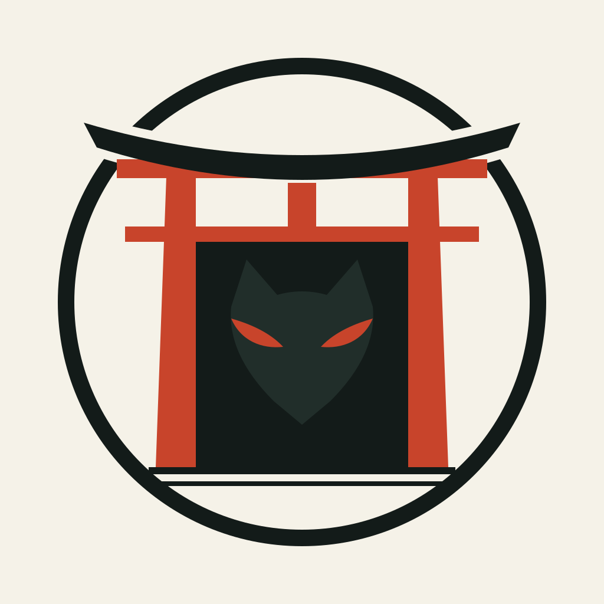
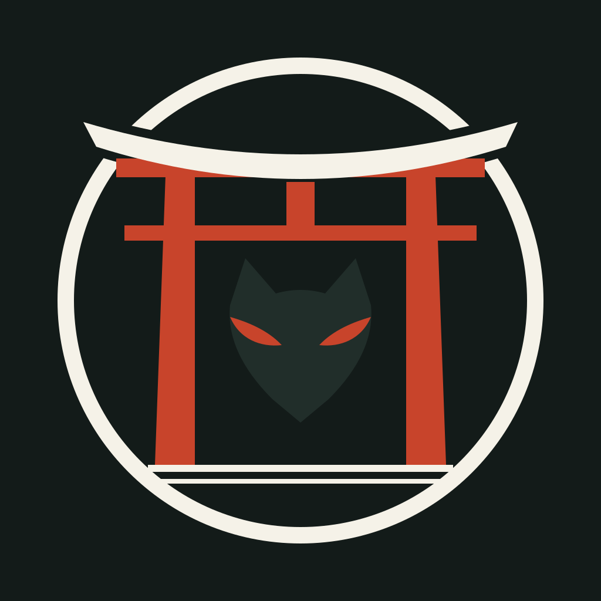
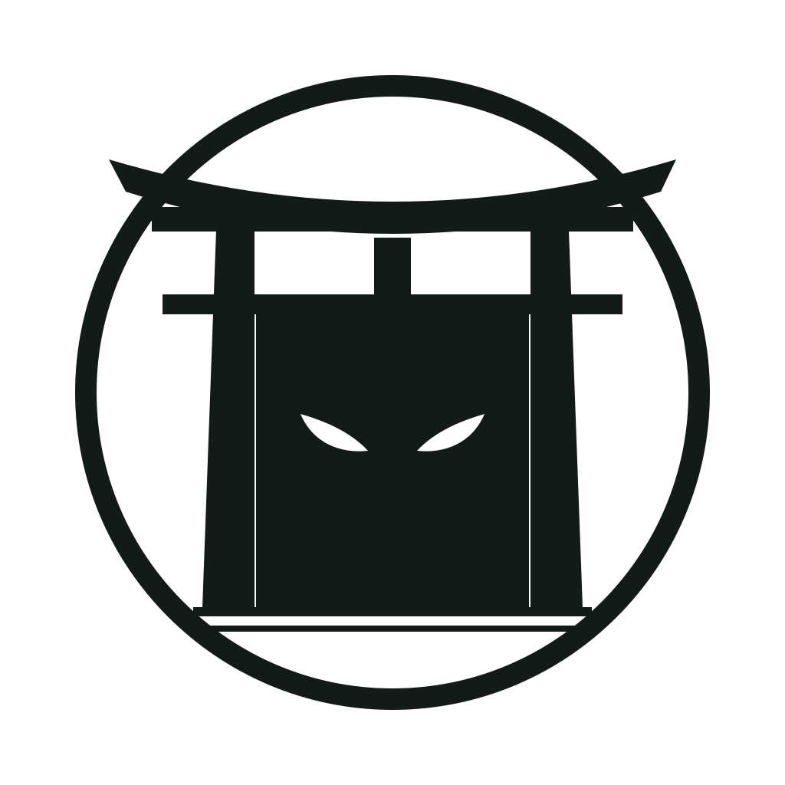
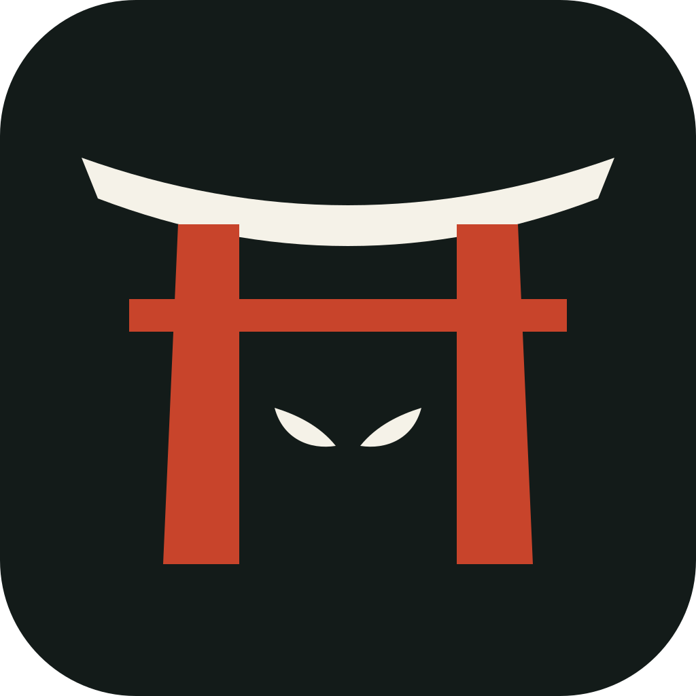

# Brand

## The mark

  
  
  
  

It is drawn from the group's logo (circle, kasagi beam, vermilion pillars, kitsune) and keeps its proportions and
palette. What changes: the fox is no longer sitting *under* the gate. It is the gate's **guardian**, reduced to a faint
head and two vermilion eyes watching from the dark: the product is the checkpoint, not the animal.

| File | Use |
|---|---|
| `assets/logo/torii-mark.svg` | default, on light backgrounds |
| `assets/logo/torii-mark-dark.svg` | on dark backgrounds |
| `assets/logo/torii-mark-transparent.svg` | on any light surface, no background tile |
| `assets/logo/torii-mark-mono.svg` | one colour (stamps, print, GitHub dark/light icons) |
| `assets/logo/torii-favicon.svg` | 16-64 px, simplified (no ground lines) |
| `assets/logo/torii-logo-horizontal*.svg` | mark + wordmark |
| `assets/banner-*.svg`, `assets/social-preview.png` | README hero, GitHub social preview (upload it in the repository settings) |
| `assets/demo.svg` | animated console replay |

Everything is generated by `python scripts/build_assets.py [--png]`, so a palette or shape change is one edit.

## Palette

| Name | Hex | Role |
|---|---|---|
| Ink | `#131B19` | ring, beam, the dark behind the gate, dark backgrounds |
| Paper | `#F5F2E8` | light backgrounds, ring on dark |
| Vermilion | `#C8442B` | pillars, eyes, the one accent colour (never for body text) |
| Muted | `#5B6662` / `#9AA39F` | secondary text on light / dark |

Status colours in terminal output follow the console: amber = would block, red = blocked, green = allowed.

## Voice

Plain, precise, honest about limits. Verbs over adjectives: *declare, approve, enforce*. Never "military-grade",
"unhackable", "100%". The README says what torii does not stop before it says why you should trust it.

## Naming the suite

The group currently calls its product line "Kitsune Suit". Findings (checked 2026-10-07):

| Candidate | Findings |
|---|---|
| **Kitsune Suit** | "suit" reads as clothing; the pun with *suite* is lost in search and in English |
| **Kitsune Suite** | spelling fixed; the GitHub names `kitsune-suite` and `kitsunesuite` are free. But "Kitsune" is also the name of an APT (Earth Kitsune) and of a Linux RAT: not a deal-breaker, but a security brand should choose it knowingly |
| **Kitsunebi** | taken: a popular V2Ray proxy client (about 1.8k stars on GitHub) |
| **Inari** | the kami of rice, commerce and **guardianship** whose messengers are foxes, and whose shrines are the ones lined with torii gates (Fushimi Inari). It makes the fox and the gate one story. `inari-suite` is free on GitHub (`inari-works` and `oinari` are taken) |

**Recommendation: *Inari* for the suite/group** (org `inari-suite`, products "by Inari"), keeping **Kitsune Suite** as the
plain-English fallback. It also gives a naming system for the next products, all from shrine vocabulary:

| Name | Meaning | Natural fit |
|---|---|---|
| **torii** 鳥居 | the gate | runtime permission firewall (this repo) |
| **shimenawa** 注連縄 | rope marking a protected boundary | resource sandboxing / capability layer |
| **ofuda** 御札 | protective talisman | secrets and license scanning |
| **komainu** 狛犬 | the guardian pair at the gate | monitoring and alerting |
| **sekisho** 関所 | checkpoint | network egress policy |

Nothing in this repository hard-codes the suite name, so the decision costs one edit.
